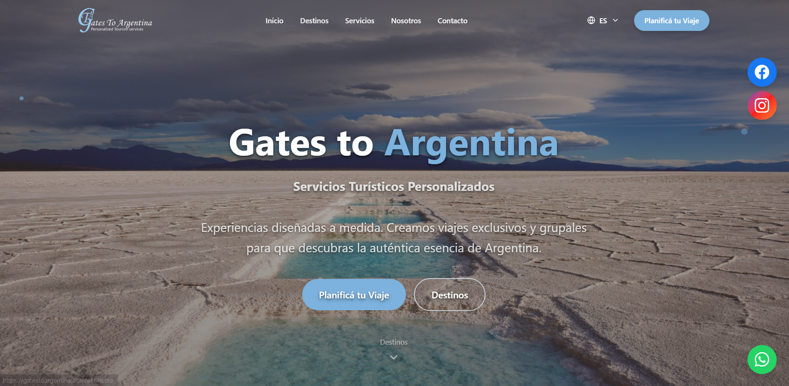
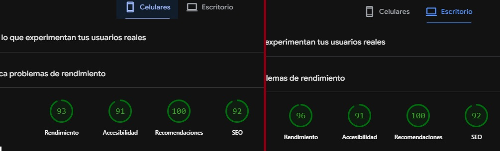

# Gates to Argentina

Sitio institucional multilenguaje para una operadora de turismo receptivo de lujo. Presenta la propuesta de la empresa, la trayectoria de su fundadora y un catálogo de módulos de viaje por regiones de Argentina, diseñado para incorporar destinos nuevos sin intervención de desarrollo.

**[Ver sitio en producción](https://gatestoargentina.com)**



---

## El problema

Gates to Israel es una operadora de turismo receptivo con trayectoria llevando viajeros de todo el mundo a Israel. El proyecto nace de la apertura de una línea nueva: **turismo receptivo de lujo en Argentina**, dirigida a ese mismo público internacional.

De ahí salieron los tres requisitos que definieron la arquitectura del sitio:

**Vender confianza antes que precio.** En turismo de lujo la decisión de compra no se toma comparando tarifas: se toma por la reputación de quien arma el viaje. Los valores de la empresa y la trayectoria de la fundadora tenían que tener el mismo peso que los destinos, y no quedar en una sección "sobre nosotros" enterrada en el menú.

**Llegar a un viajero que busca desde afuera.** El público es internacional y encuentra a la operadora buscando en su propio idioma. El sitio tenía que estar traducido, servir cada idioma en su propia URL y ser indexable: no alcanzaba con traducir la interfaz en el navegador.

**Crecer sin rehacer nada.** La propuesta se organiza en módulos de viaje por región, y la operadora iba a ir sumando más a medida que ampliara el catálogo. Agregar un módulo no podía significar programar una página nueva cada vez.

## Qué hace

- **Módulos de viaje por región** de Argentina, definidos como datos tipados y renderizados por una plantilla común: sumar un destino es agregar una entrada, no construir una página.
- **Presentación institucional** con los valores de la empresa y la trayectoria de la fundadora como parte central del recorrido.
- **Sitio multilenguaje con rutas localizadas** vía `next-intl` y middleware de Next: cada idioma tiene su propia URL, indexable de forma independiente por los buscadores.
- **Renderizado en servidor**: las páginas llegan al navegador y al robot de Google con el HTML ya construido.
- **Formulario de consulta** validado con React Hook Form y Zod, que envía la solicitud directamente a la operadora.
- **Selección de fechas** de viaje con `react-day-picker` y `date-fns`.
- **Diseño responsive**, pensado primero para mobile.
- **Modo claro / oscuro**.

## Rendimiento

Resultados de Lighthouse vía PageSpeed Insights:

| | Rendimiento | Accesibilidad | Prácticas recomendadas | SEO |
|---|---|---|---|---|
| **Escritorio** | 96 | 91 | 100 | 92 |
| **Celulares** | 93 | 91 | 100 | 92 |

 

## Stack y por qué

| Tecnología | Rol | Por qué esta |
|---|---|---|
| Next.js 16 (App Router) | Framework | El sitio vive de ser encontrado en buscadores desde varios países. El renderizado en servidor entrega el contenido ya construido, sin depender de que el rastreador ejecute JavaScript. |
| React 19 + TypeScript | UI | Los módulos de viaje están tipados: sumar un destino es agregar un objeto que el compilador valida contra el contrato esperado. |
| `next-intl` + middleware | Internacionalización | Rutas localizadas por idioma, cada una indexable por separado. La traducción vive en el ruteo, no en el cliente. |
| Tailwind CSS 4 + shadcn/ui (Radix) | Estilos y componentes | Componentes accesibles por defecto, sin arrastrar una librería visual pesada. |
| React Hook Form + Zod | Formularios | Validación tipada del formulario de consulta. |
| smtpexpress | Email | Envío de las consultas a la operadora. |
| Vercel | Deploy | Despliegue continuo desde `main`. |

## Estructura

```
app/           Rutas del App Router
sections/      Secciones de página compuestas
components/    Componentes reutilizables
hooks/         Lógica de interfaz reutilizable
i18n/          Configuración y archivos de traducción
types/         Contratos de datos (módulos de viaje, contenidos)
lib/           Utilidades
middleware.ts  Resolución de idioma y rutas localizadas
```

## Correrlo localmente

```bash
git clone https://github.com/JuanCarriles/gatestoargentina.git
cd gatestoargentina
npm install
cp .env.example .env.local
npm run dev
```

Abrir http://localhost:3000

Variables de entorno necesarias:
"SMTP_PROJECT_ID // SMTP_PROJECT_SECRET // SMTP_SENDER_EMAIL": Variables de entorno necesarias para el envió de mails vía SMTP.

## Decisiones técnicas

### Next.js en lugar de una SPA

Este sitio se construyó primero como una SPA con React y Vite, y se rehízo sobre Next.js por una razón concreta: en una aplicación renderizada en el cliente, el HTML inicial llega prácticamente vacío y el contenido aparece recién cuando el navegador ejecuta el JavaScript. Para un negocio cuyos clientes lo encuentran buscando "luxury travel Argentina" desde el otro lado del mundo, hacer depender la indexación de eso es un riesgo que no hace falta correr — y además afecta a las vistas previas de los enlaces al compartirlos, que en este rubro son parte del canal.

Con el App Router, la página llega renderizada desde el servidor: el buscador recibe el contenido en la primera respuesta.

No es una regla universal. En [Bejuca](https://github.com/JuanCarriles/bejuca-next) elegí Next.js por un motivo distinto —había credenciales de pasarelas de pago y consultas a MySQL que no podían vivir en el cliente—, y en proyectos sin requisitos de posicionamiento ni de servidor, una SPA sigue siendo la opción más simple. La herramienta la define el problema.

### Rutas localizadas en lugar de traducción en el cliente

Traducir la interfaz en el navegador es suficiente para que un usuario lea el sitio, pero deja un solo URL para todos los idiomas: los buscadores indexan una sola versión y el contenido traducido no compite en las búsquedas de cada mercado. Con `next-intl` y el middleware, cada idioma tiene su propia ruta y se indexa por separado, que es lo que corresponde cuando el público está repartido en varios países.

La pagina actualmente opera en 3 idiomas: Ingles, Español y Hebreo

## Estado

En producción sin mantenimiento.

---

Desarrollado por [Juan M. Carriles](https://www.linkedin.com/in/juan-maria-carriles-8836512a2/) · juanmcarrile@gmail.com
